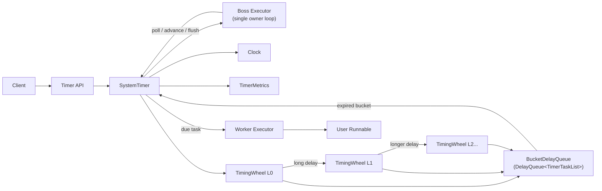

# timewheel4j

`timewheel4j` is a Kafka-style hierarchical timing wheel for massive delayed
scheduling in Java.

The project focuses on one idea:

> Use a `DelayQueue` for bucket expiration, not for every delayed task.

Tasks are stored inside hierarchical wheel buckets. The global delay queue only
contains non-empty buckets, so expiration work is driven by active buckets rather
than total scheduled task count.

The core scheduler design is inspired by Apache Kafka's hierarchical timing
wheel implementation: bucket-level delay queue, intrusive bucket lists, overflow
wheel cascading, and re-adding entries when higher-level buckets expire. The
code in this repository is an independent Java library implementation with its
own API, tests, Spring integration, metrics, and benchmark modules.

`timewheel4j` also uses a boss/worker execution model. The boss loop owns the
timing wheel, polls expired buckets, advances the clock, and submits due tasks.
Worker threads execute user `Runnable` instances, so slow or blocking user code
does not block wheel advancement and bucket cascading.

## Status

This repository has been reset around the new scheduler core. The previous
delay-queue facade, event registry, scheduler group, and worker group layers
have been removed.

Current implementation:

- Maven reactor with `timewheel4j-core`, `timewheel4j-bom`, and Spring Boot
  starter modules
- public `Timer` API
- public `Timeout` cancellation handle
- `TimerBuilder` for configuration
- Kafka-style `SystemTimer`
- boss executor for the single timing-wheel owner loop
- bounded worker executor for expired task execution
- hierarchical `TimingWheel` with overflow wheels
- bucket-level `BucketDelayQueue` backed by `DelayQueue<TimerTaskList>`
- intrusive task list for bucket membership
- pending timeout count via `Timer.size()`
- immutable metrics snapshots via `Timer.metrics()`
- deterministic clock hooks for exact internal cascade tests
- Spring Boot 2.x starter and Spring Boot 3.x starter
- CI toolchain support for Java 11 core and Java 17 Boot 3 starter
- JUnit 5 Given-When-Then tests
- JaCoCo coverage gate for 85%+ line and branch coverage

## Install

Use the BOM when consuming more than one artifact:

```xml
<properties>
    <timewheel4j.version>REPLACE_WITH_LATEST_RELEASE</timewheel4j.version>
</properties>

<dependencyManagement>
    <dependencies>
        <dependency>
            <groupId>io.github.photowey</groupId>
            <artifactId>timewheel4j-bom</artifactId>
            <version>${timewheel4j.version}</version>
            <type>pom</type>
            <scope>import</scope>
        </dependency>
    </dependencies>
</dependencyManagement>
```

Core scheduler only:

```xml
<dependency>
    <groupId>io.github.photowey</groupId>
    <artifactId>timewheel4j-core</artifactId>
</dependency>
```

Spring Boot 2.x:

```xml
<dependency>
    <groupId>io.github.photowey</groupId>
    <artifactId>timewheel4j-spring-boot-starter</artifactId>
</dependency>
```

Spring Boot 3.x:

```xml
<dependency>
    <groupId>io.github.photowey</groupId>
    <artifactId>timewheel4j-spring-boot3-starter</artifactId>
</dependency>
```

## Quick Start

```java
import io.github.photowey.timewheel4j.hierarchical.timewheel.timer.Timeout;
import io.github.photowey.timewheel4j.hierarchical.timewheel.timer.Timer;
import io.github.photowey.timewheel4j.hierarchical.timewheel.timer.TimerBuilder;

import java.util.concurrent.TimeUnit;

Timer timer = TimerBuilder.builder()
        .tick(1, TimeUnit.MILLISECONDS)
        .wheelSize(512)
        .bossName("timewheel-boss")
        .workerThreads(4)
        .workerQueueCapacity(100_000)
        .workerName("timewheel-worker")
        .build();

Timeout timeout = timer.schedule(
        () -> System.out.println("done"),
        100,
        TimeUnit.MILLISECONDS);

long pendingTimeouts = timer.size();
long expiredTimeouts = timer.metrics().expiredTimeouts();

timeout.cancel();
timer.shutdown();
```

## Design In One Picture



## Boss-Worker Execution Model

`timewheel4j` separates scheduling from task execution.

- The boss executor owns the timing wheel and runs one scheduler loop per
  `SystemTimer`.
- The boss loop polls expired buckets, advances the wheel clock, flushes bucket
  entries, cascades entries back into lower-level wheels, and submits due tasks.
- The boss loop never runs user `Runnable` code directly.
- Worker executors run expired user tasks, so slow or blocking task logic does
  not block bucket expiration, wheel advancement, or cascade processing.
- Applications may use the built-in executors or provide caller-owned boss and
  worker `ExecutorService` instances.

Read the full developer guide here:

- [Architecture and sequence diagrams](docs/architecture.md)

## Module Layout

```text
timewheel4j
  timewheel4j-bom
  timewheel4j-core
    src/main/java/io/github/photowey/timewheel4j/hierarchical/timewheel/timer/
    src/test/java/io/github/photowey/timewheel4j/hierarchical/timewheel/timer/
    src/jmh/java/io/github/photowey/timewheel4j/hierarchical/timewheel/benchmark/
  timewheel4j-spring
    timewheel4j-spring-boot-autoconfigure
    timewheel4j-spring-boot-starter
    timewheel4j-spring-boot3-starter
```

## Build

```bash
make test
make verify
```

`make verify` runs the full JUnit 5 suite and enforces the JaCoCo coverage gate.
Current thresholds are 85% line coverage and 85% branch coverage at bundle
level.

The core module targets Java 11. The Boot 3 starter targets Java 17. Local builds
do not require a Maven toolchain file by default:

```bash
make verify
```

CI enables the `toolchain` profile after writing `~/.m2/toolchains.xml`:

```bash
make toolchain-verify
```

Use `make help` to list all local build, verification, benchmark, release, and
GitNexus helper targets. The Makefile uses `mvn` by default; override it with
`make MVN=/path/to/mvn verify` when needed.

## Spring Boot

The Spring modules auto-configure a singleton `Timer` bean when the starter is
on the classpath and no user-defined `Timer` bean exists.

```yaml
timewheel4j:
  enabled: true
  tick: 1ms
  wheel-size: 512
  boss:
    name: timewheel-boss
    executor:
      auto-create: true
      bean-name:
  worker:
    threads: 4
    queue-capacity: 100000
    name: timewheel-worker
    executor:
      auto-create: true
      bean-name:
```

Boot 2.x applications use `timewheel4j-spring-boot-starter`. Boot 3.x
applications use `timewheel4j-spring-boot3-starter`. The shared
`timewheel4j-spring-boot-autoconfigure` module contains only
`Timewheel4jProperties` and `AbstractTimewheel4jConfiguration`. Starter modules
own the actual auto-configuration metadata:

- Boot 2.x starter registers `Timewheel4jConfiguration` through
  `spring.factories` for traditional Boot auto-configuration.
- Boot 2.7+ starter also registers `Timewheel4jAutoConfiguration` through
  `AutoConfiguration.imports`.
- Boot 3.x starter registers its own `Timewheel4jAutoConfiguration` through
  `AutoConfiguration.imports`.

The older flat properties `timewheel4j.worker-threads`,
`timewheel4j.worker-name`, `timewheel4j.worker-queue-capacity`, and
`timewheel4j.scheduler-name` remain supported as compatibility aliases.

By default, Spring auto-creates two managed executor beans:

- `timewheel4jBossExecutor`
- `timewheel4jWorkerExecutor`

The timer uses those beans, and Spring owns their lifecycle. If
`executor.bean-name` is configured, auto-creation backs off and the timer looks
up that caller-owned `ExecutorService` bean by name. If `executor.auto-create`
is set to `false` and no bean name is configured, the timer falls back to the
core library defaults and owns its internal executor.

The compatibility aliases `timewheel4j.boss.executor-bean-name` and
`timewheel4j.worker.executor-bean-name` remain supported.

## Benchmark

JMH benchmarks are isolated behind the `benchmark` profile so normal CI stays
fast:

```bash
make benchmark-package
make benchmark
```

For a quick smoke run:

```bash
make benchmark-smoke
```

Current benchmark baselines compare:

- `SystemTimer`, the hierarchical timing wheel
- JDK `ScheduledExecutorService`
- Netty `HashedWheelTimer`
- a simple one-entry-per-task `DelayQueue`

Parameters cover task count, delay range, cancellation ratio, and JMH worker
threads. Use `-t N` to model multiple producer threads scheduling concurrently:

```bash
java -jar timewheel4j-core/target/timewheel4j-core-benchmarks.jar '.*TimerBenchmark.*' \
  -p taskCount=10000 \
  -p maxDelayMillis=60000 \
  -p cancelPercent=50 \
  -t 4
```

Stress-oriented suites are in `TimerStressBenchmark`. They default to
million-task matrices and are intentionally kept out of default CI:

```bash
make benchmark-stress
```

For a tiny stress smoke:

```bash
java -jar timewheel4j-core/target/timewheel4j-core-benchmarks.jar '.*TimerStressBenchmark.*' \
  -p taskCount=1000 \
  -p maxDelayMillis=100 \
  -p cancelPercent=50 \
  -wi 0 -i 1 -r 1 -w 1 -f 1 \
  -rf json -rff timewheel4j-core/target/jmh-stress-smoke.json
```

## Metrics

`Timer.metrics()` returns an immutable `TimerMetrics` snapshot:

```java
TimerMetrics metrics = timer.metrics();

long scheduled = metrics.scheduledTimeouts();
long expired = metrics.expiredTimeouts();
long cancelled = metrics.cancelledTimeouts();
long rejected = metrics.rejectedTimeouts();
long pending = metrics.pendingTimeouts();
long bucketOffers = metrics.bucketOffers();
long bucketExpirations = metrics.bucketExpirations();
long maxBucketDelayMs = metrics.maxBucketDelayMs();
```

The metrics are designed for local observability and benchmark diagnostics.
They do not add a metrics backend dependency.

## Release

The project follows the same Maven Central publishing shape as `mongo-plus`:

```bash
mvn -Ptoolchain,release deploy
```

The `release` profile attaches source and javadoc jars, signs artifacts with
GPG, and publishes through the Sonatype Central Publishing Maven Plugin. The
`toolchain` profile is used in CI/release workflows so core artifacts are built
with Java 11 and the Boot 3 starter is built with Java 17.

GitHub Actions includes:

- `Java CI with Maven`: installs JDK 11 and JDK 17, configures Maven
  toolchains, runs `mvn -B -Ptoolchain verify`, then builds the benchmark jar
- `Maven Central Release`: manual workflow that sets the release version and
  runs `mvn -B -Ptoolchain,release -DskipTests deploy`

Configure these repository secrets before running the release workflow:

- `MAVEN_CENTRAL_USERNAME`
- `MAVEN_CENTRAL_PASSWORD`
- `MAVEN_CENTRAL_GPG_PRIVATE_KEY`
- `MAVEN_CENTRAL_GPG_PASSPHRASE`
- `MAVEN_CENTRAL_KEY_NAME`

## Testing Style

All unit tests use a Given-When-Then structure:

```java
@Test
void givenPendingTasksWhenOneIsCancelledAndOneExpiresThenSizeTracksActiveTimeouts() {
    // Given
    ...

    // When
    ...

    // Then
    ...
}
```

The suite covers public API behavior, builder validation, timeout state
transitions, bucket list invariants, and timing-wheel placement/cascade logic.

The core project targets Java 11 and uses the Maven compiler `release` option to
produce Java 11 bytecode. The Boot 3 starter targets Java 17 because Spring Boot
3.x and Spring Framework 6 require it.

## Future Work

- benchmark result publishing and historical comparison reports
- optional adapters for Micrometer or other metrics backends
- contention tuning for hot buckets and high cancellation rates
- richer delay distribution generators for benchmark workloads
