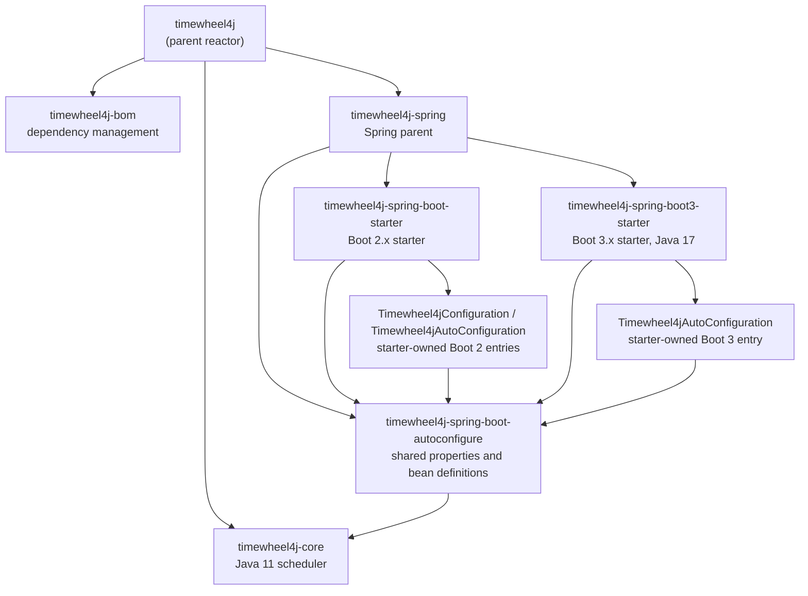
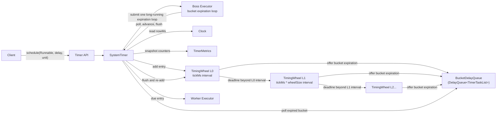
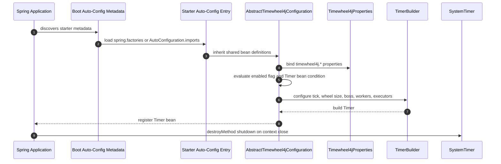
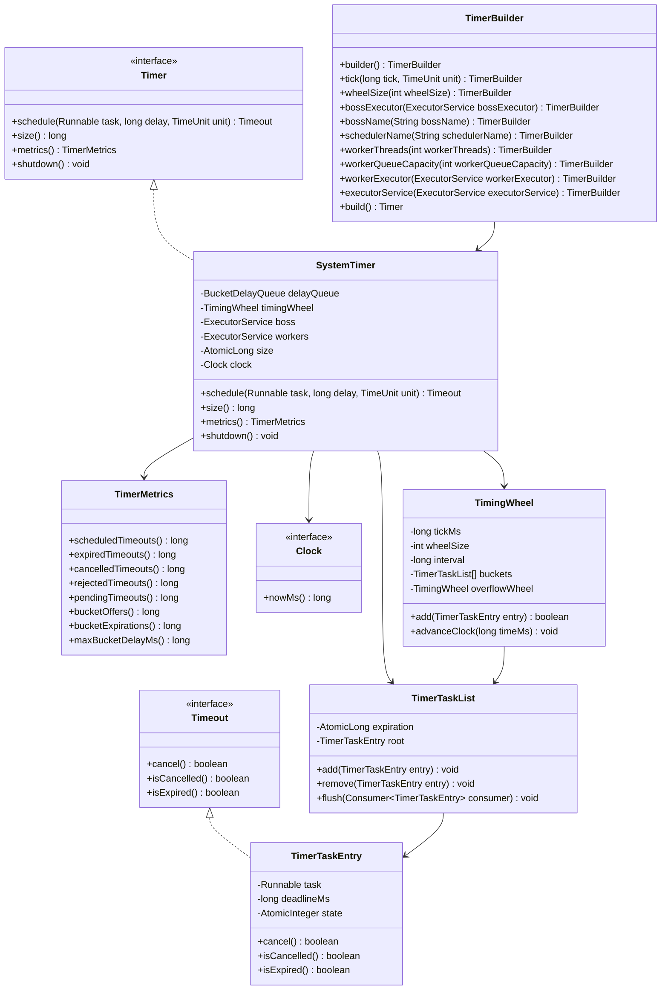
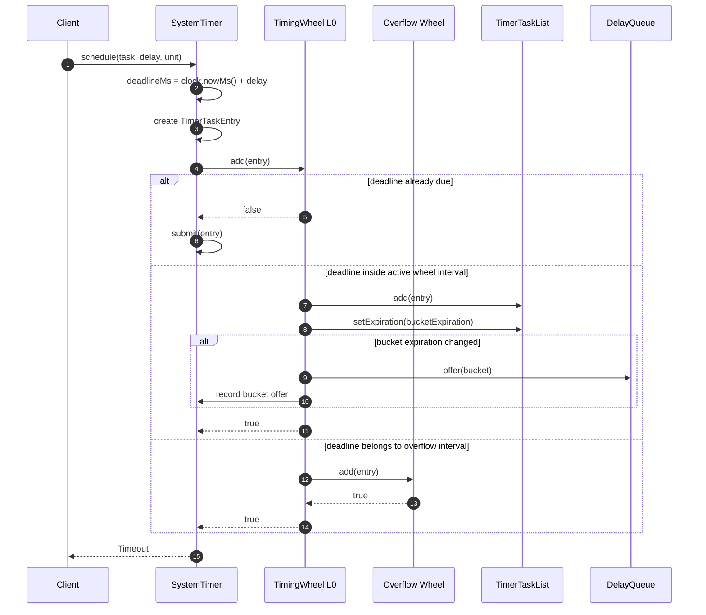
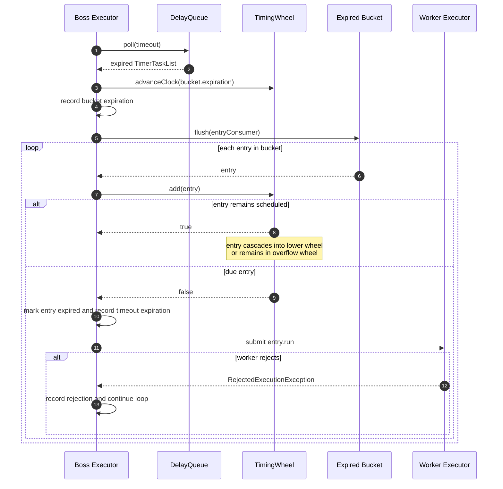
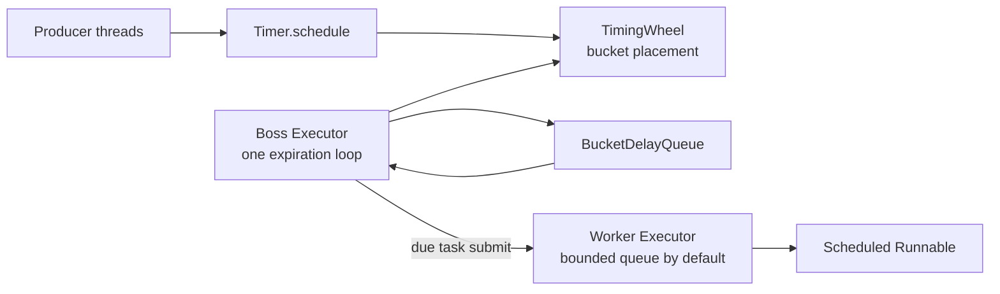
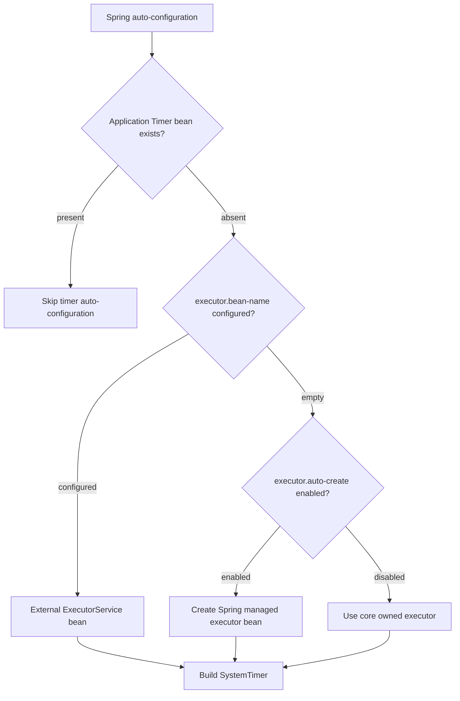
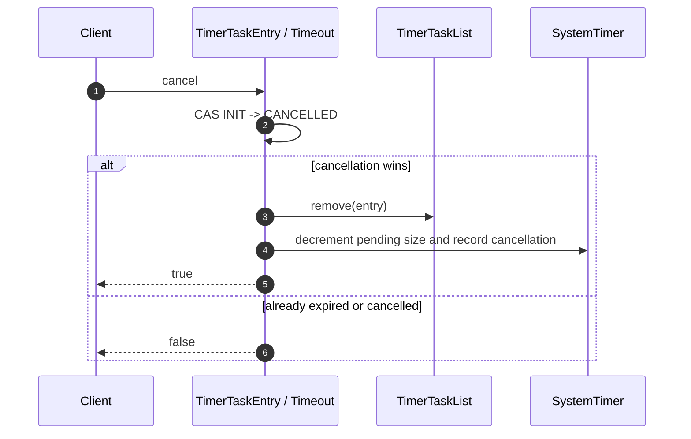
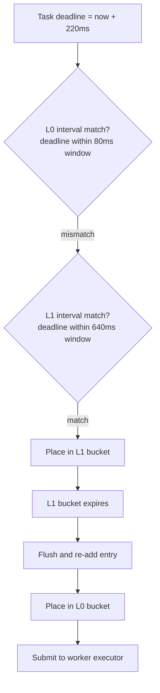

# timewheel4j Architecture

Engineering specification for the `timewheel4j` scheduler, module layout,
runtime model, Spring Boot integration, tests, and benchmark assets.

## Design Scope

`timewheel4j` is a Java 11 scheduling library based on a Kafka-style
hierarchical timing wheel.

Core placement model:

- `Timer.schedule(Runnable, long, TimeUnit)` creates `TimerTaskEntry` handles.
- `TimingWheel` places entries into `TimerTaskList` buckets by deadline.
- `BucketDelayQueue` stores `TimerTaskList` bucket expiration entries.
- Overflow `TimingWheel` levels represent coarser time intervals.
- Expired bucket flush re-adds entries to lower wheel levels or dispatches due
  entries.
- Worker executors run expired scheduled `Runnable` instances.

Reference model:

- Apache Kafka timer-style bucket-level delay queue.
- Intrusive task membership inside each bucket.
- Overflow wheel cascading for deadlines beyond the active interval.
- Bucket flush and re-add on coarse bucket expiration.

## Architecture Overview

Maven reactor:



Core scheduler graph:



Spring Boot auto-configuration:



## Core Types



## Scheduling Sequence



## Expiration And Cascade Sequence



## Execution Model

`SystemTimer` uses a boss/worker execution model.

Boss executor responsibilities:

- Poll `BucketDelayQueue`.
- Advance `TimingWheel` clocks.
- Flush expired `TimerTaskList` buckets.
- Re-add flushed entries to wheel levels.
- Submit due entries to the worker executor.
- Maintain bucket expiration metrics.

Worker executor responsibilities:

- Execute expired scheduled `Runnable` instances.
- Isolate scheduled task execution from bucket expiration processing.
- Apply configured worker thread count and queue capacity.



Boss executor configuration:

- Default: single-thread executor.
- External executor option: `TimerBuilder.bossExecutor(ExecutorService)`.
- Runtime unit: one long-running bucket expiration loop per `SystemTimer`.
- Ownership: one boss loop owns bucket expiration polling and wheel advancement
  for a `SystemTimer`.

Worker executor configuration:

- Default: fixed-size `ThreadPoolExecutor`.
- Queue: bounded by `workerQueueCapacity`.
- External executor options:
  `TimerBuilder.workerExecutor(ExecutorService)` and
  `TimerBuilder.executorService(ExecutorService)`.
- Rejection metric: `TimerMetrics.rejectedTimeouts()`.

## Spring Executor Lifecycle

Spring Boot starter executor beans:

- `timewheel4jBossExecutor`
- `timewheel4jWorkerExecutor`

Executor resolution order:

1. Resolve `timewheel4j.boss.executor.bean-name` and
   `timewheel4j.worker.executor.bean-name` when configured.
2. Create Spring managed executor beans when `executor.auto-create=true`.
3. Delegate executor creation to `SystemTimer` when
   `executor.auto-create=false`.



## Cancellation Sequence



## Multi-Level Wheel Placement

Example parameters:

```text
tickMs = 10
wheelSize = 8
L0 interval = 10ms * 8 = 80ms
L1 interval = 80ms * 8 = 640ms
L2 interval = 640ms * 8 = 5120ms
```

Placement for a 220ms deadline:

1. `TimingWheel L0` compares deadline against the 80ms interval.
2. `TimingWheel L1` accepts the deadline inside the 640ms interval.
3. The L1 bucket expiration reaches the delay queue.
4. The boss loop flushes the L1 bucket and re-adds the entry.
5. The entry moves into an L0 bucket.
6. The L0 bucket expiration dispatches the entry to the worker executor.



## Core Invariants

- A `TimerTaskEntry` belongs to at most one `TimerTaskList` at a time.
- A bucket is offered to `BucketDelayQueue` only when its expiration changes.
- `BucketDelayQueue` wraps the JDK `DelayQueue` and returns `Optional` from
  poll/peek operations.
- The underlying JDK `DelayQueue` stores `TimerTaskList` buckets.
- A `SystemTimer` submits exactly one boss loop. That loop owns bucket
  expiration polling and wheel advancement.
- Boss code submits due entries to the worker executor.
- `TimerTaskEntry.cancel()` removes the entry from its assigned bucket after a
  successful cancellation state transition.
- Pending size is incremented once when scheduling and decremented once when the
  entry reaches a terminal state: cancelled or expired.
- `TimingWheel.add(entry)` returns `false` for due entries.
- `Clock` is package-private and supplies deterministic time for tests.
- `TimerMetrics` is a snapshot; counters are monotonic except pending timeout
  count.

## Implementation Files

Core package: `timewheel4j-core/src/main/java`.

| File                      | Responsibility                                                                      |
|---------------------------|-------------------------------------------------------------------------------------|
| `Timer.java`              | Public scheduling API.                                                              |
| `Timeout.java`            | Public cancellation and state handle.                                               |
| `TimerMetrics.java`       | Immutable metrics snapshot.                                                         |
| `TimerBuilder.java`       | Builder for `SystemTimer`.                                                          |
| `Clock.java`              | Package-private time source for production and deterministic tests.                 |
| `BucketDelayQueue.java`   | Optional-based wrapper around the JDK bucket delay queue.                           |
| `SystemTimer.java`        | Boss loop, delay queue polling, wheel advancement, worker submission, pending size. |
| `TimingWheel.java`        | Hierarchical wheel placement, overflow wheel creation, clock advancement.           |
| `TimerTaskList.java`      | Delayed bucket and intrusive linked list.                                           |
| `TimerTaskEntry.java`     | Scheduled task node and timeout state machine.                                      |
| `TimerThreadFactory.java` | Daemon thread creation for scheduler and owned workers.                             |

Spring package: `timewheel4j-spring`.

`timewheel4j-spring-boot-autoconfigure`:

- `Timewheel4jProperties.java`: binds `timewheel4j.*` properties.
- `AbstractTimewheel4jConfiguration.java`: shared bean definitions for
  starter-owned auto-configuration entries.

`timewheel4j-spring-boot-starter`:

- `Timewheel4jConfiguration.java`: traditional Boot 2.x `@Configuration`
  entrypoint for `spring.factories`.
- `Timewheel4jAutoConfiguration.java`: Boot 2.7+ `@AutoConfiguration`
  entrypoint for `AutoConfiguration.imports`.
- `META-INF/spring.factories`: Boot 2.x starter-owned auto-configuration
  metadata.
- `META-INF/spring/org.springframework.boot.autoconfigure.AutoConfiguration.imports`:
  Boot 2.7+ starter-owned auto-configuration metadata.
- `pom.xml`: Boot 2.x starter dependencies.

`timewheel4j-spring-boot3-starter`:

- `Timewheel4jAutoConfiguration.java`: Boot 3.x starter-owned
  `@AutoConfiguration` entrypoint.
- `META-INF/spring/org.springframework.boot.autoconfigure.AutoConfiguration.imports`:
  Boot 3.x starter-owned auto-configuration metadata.
- `pom.xml`: Boot 3.x starter dependencies and Java 17 compiler release.

## Testing Specification

Unit test format:

- Framework: JUnit 5.
- Structure: Given-When-Then.
- Naming: behavior specification style.

```java
@Test
void givenCancelledTaskWhenDeadlineExpiresThenTaskIsNotExecuted() {
    // Given
    ...

    // When
    ...

    // Then
    ...
}
```

Test coverage scope:

- `SystemTimer` public scheduling behavior, shutdown, cancellation, zero-delay
  execution, external boss/worker executors, owned boss/worker naming, bounded
  worker queues, metrics, shutdown race rejection, and invalid arguments.
- `TimerBuilder` defaults and all validation branches.
- `TimerTaskEntry` state transitions and completion callback idempotency.
- `TimerTaskList` expiration, move-between-lists behavior, flush behavior, and
  ordering.
- `BucketDelayQueue` empty and expired-bucket Optional semantics.
- `TimingWheel` due-task detection, bucket offer behavior, overflow placement,
  cancelled-entry handling, deterministic cascade behavior, and clock
  advancement.
- `AbstractTimewheel4jConfiguration` default creation, disabled mode,
  application bean override, nested property binding, compatibility property
  binding, external executor bean names, invalid tick rejection, and schedule
  operation validation.
- `Timewheel4jBootStarterTest` validates the Boot 2 starter entrypoints and
  starter-owned metadata on a Boot 2 runtime.
- `Timewheel4jBoot3StarterTest` validates the Boot 3 starter-owned
  `@AutoConfiguration` entrypoint and metadata on a Boot 3 runtime.

## Benchmark And Stress Strategy

Benchmark source set: `timewheel4j-core/src/jmh/java`.

Maven profile: `benchmark`.

- `TimerBenchmark` compares `SystemTimer`, JDK `ScheduledExecutorService`,
  Netty `HashedWheelTimer`, and a per-task `DelayQueue` baseline.
- `TimerStressBenchmark` runs high-volume schedule/cancel matrices, including
  million-task workloads.
- Producer concurrency uses JMH thread parameters, for example `-t 4`.
- CI benchmark phase builds the JMH benchmark jar.

Coverage gate:

```text
line coverage   >= 85%
branch coverage >= 85%
```

CI commands:

```bash
mvn -B -Ptoolchain verify
mvn -B -Pbenchmark -pl timewheel4j-core -am -DskipTests package
```

Toolchain profile requirements:

- JDK 11 entry in `~/.m2/toolchains.xml`.
- JDK 17 entry in `~/.m2/toolchains.xml`.

## Extension Surface

Extension areas:

1. Benchmark result history.
2. Micrometer and metrics backend adapters.
3. Hot-bucket contention tuning.
4. High-cancellation workload tuning.
5. Delay distribution generators for benchmark workloads.
