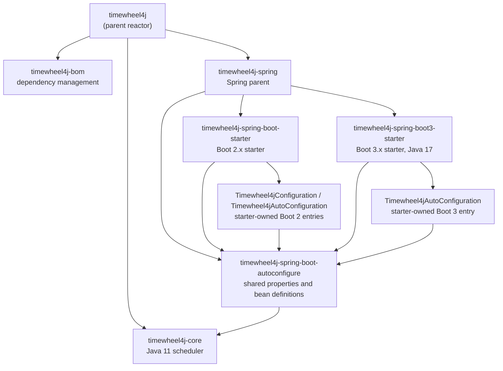
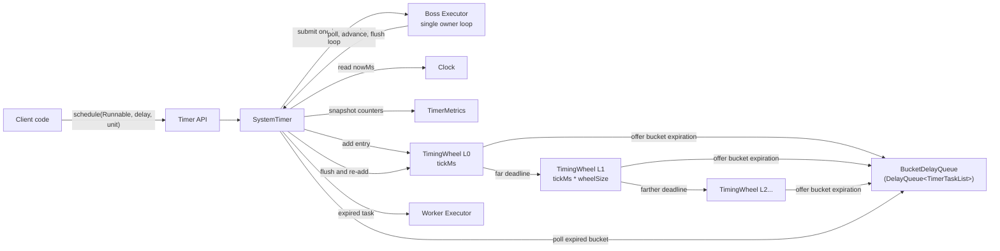
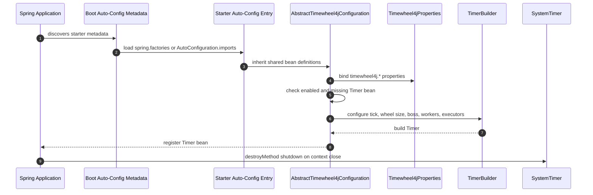
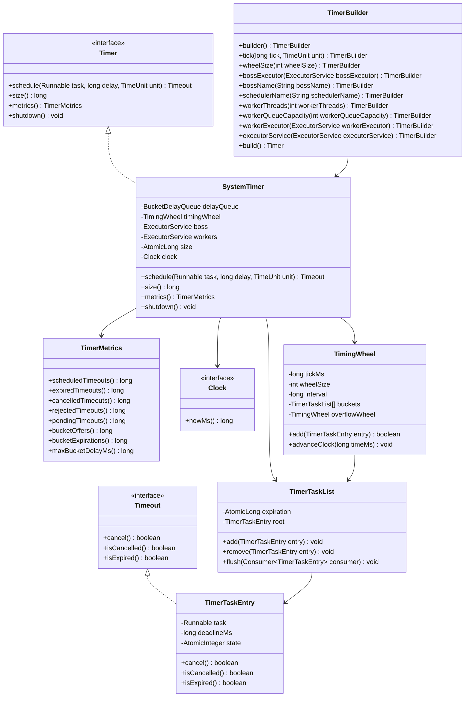
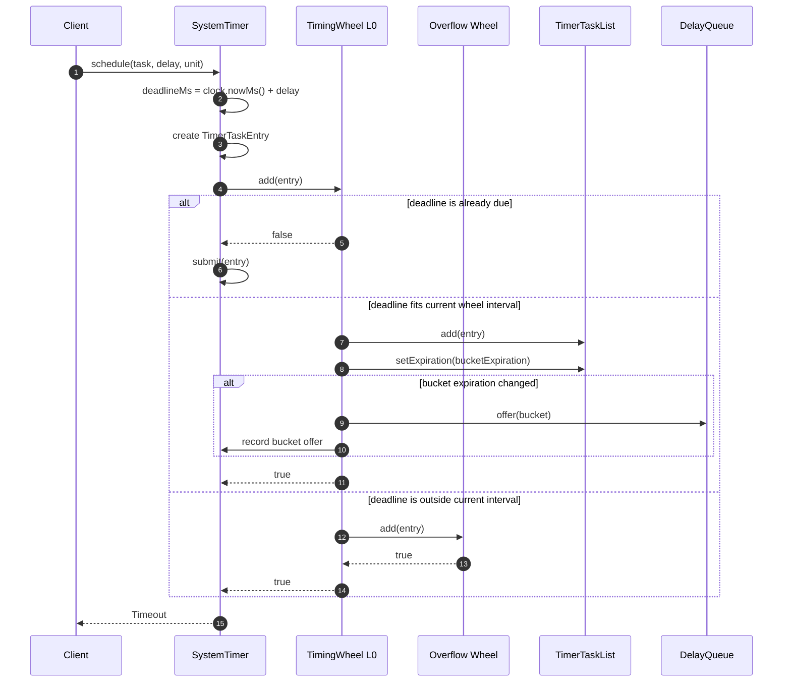
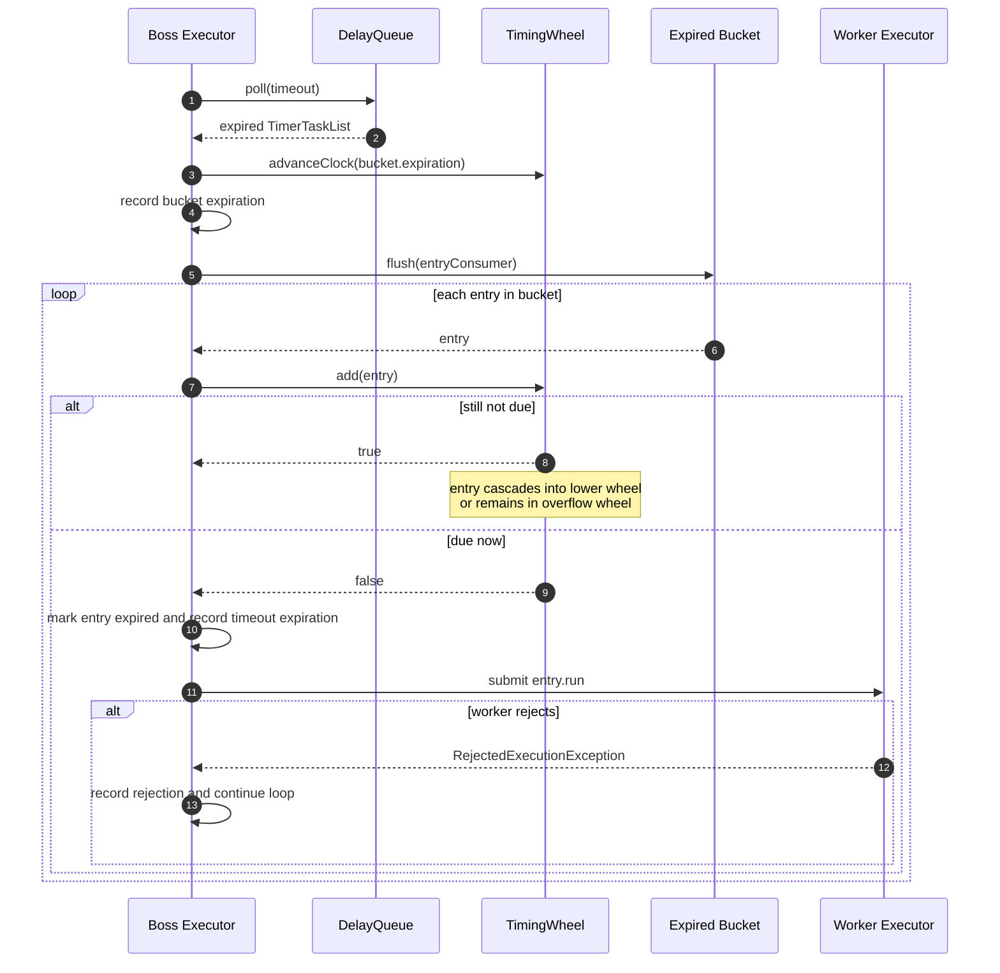
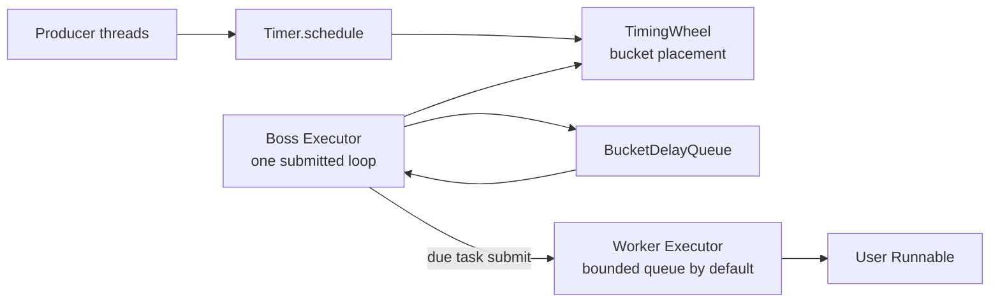
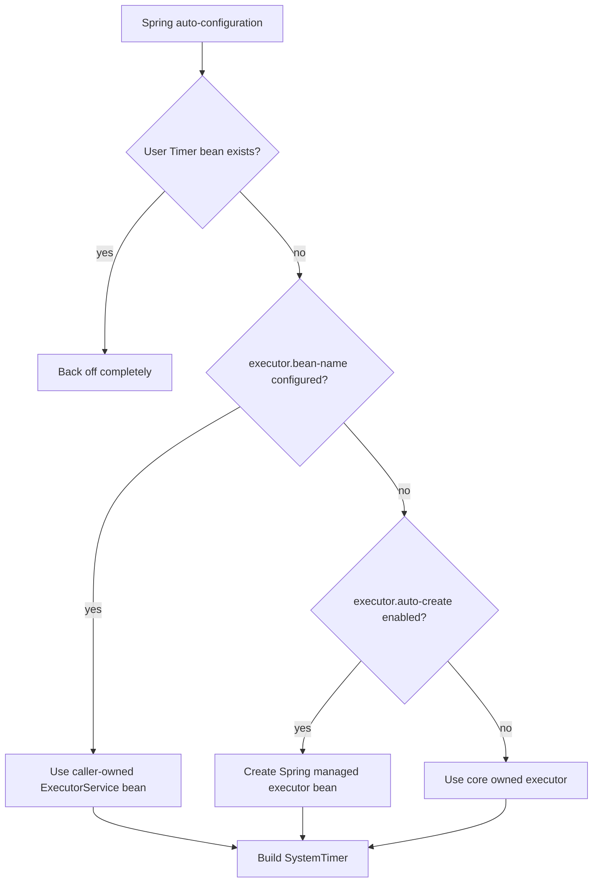
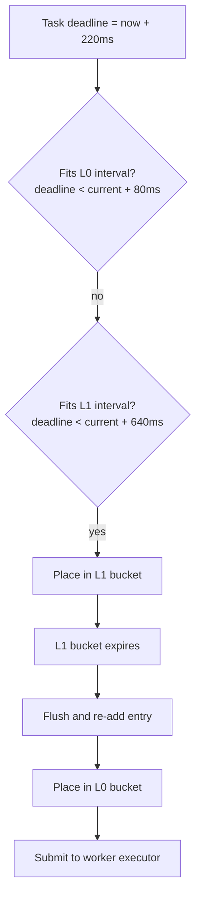

# timewheel4j Architecture

This document explains the current design of `timewheel4j` for developers who
want to understand, maintain, or extend the scheduler.

## Design Goal

`timewheel4j` implements a Kafka-style hierarchical timing wheel for massive
delayed scheduling.

The most important design choice is:

> The JDK `DelayQueue` stores bucket lists, not individual tasks.

This keeps the global delay queue small when many tasks share nearby deadlines.
Tasks live inside wheel buckets. The delay queue only wakes the scheduler when a
non-empty bucket reaches its expiration time.

The implementation intentionally follows the same scheduling model used by
Apache Kafka's timer: a `DelayQueue` of bucket lists, intrusive task membership
inside each bucket, overflow wheels for deadlines outside the current interval,
and bucket flush/re-add when a coarse bucket expires. `timewheel4j` keeps that
core idea but exposes it as an independent Java 11 library with a smaller public
API, boss/worker executor separation, metrics snapshots, Spring Boot starters,
and JMH benchmark suites.

## Architecture Overview

The Maven reactor is split by responsibility:



The scheduler itself lives in `timewheel4j-core`:



The Spring Boot integration is intentionally thin:



## Core Types



## Scheduling Sequence



## Expiration And Cascade Sequence



## Execution Model

`SystemTimer` uses a boss/worker split:

The boss side is optimized for timer correctness and low scheduling latency. It
is the single owner that polls bucket expirations, advances the hierarchical
wheel, flushes buckets, and decides whether an entry should be cascaded or
submitted. It never runs user `Runnable` code directly. The worker side is
optimized for event handling: worker threads execute expired user tasks and can
be sized, bounded, or supplied by the caller independently from the boss loop.



The default boss executor is a single-thread executor. A caller may supply any
`ExecutorService`, but each `SystemTimer` submits exactly one long-running boss
loop to it. Multiple boss threads do not concurrently advance the same wheel.

The default worker executor is a fixed-size `ThreadPoolExecutor` with a bounded
queue. A worker rejection increments `rejectedTimeouts`; when rejection happens
inside the boss loop, the loop continues processing later buckets. Immediate
zero-delay submissions from caller threads still surface
`RejectedExecutionException` to the caller.

## Spring Executor Lifecycle

The Spring Boot starter keeps executor management outside the core timer API.
When no user `Timer` bean exists, the auto-configuration can create two named
executor beans:

- `timewheel4jBossExecutor`
- `timewheel4jWorkerExecutor`

The auto-configuration resolves executors in this order:

1. Use `timewheel4j.boss.executor.bean-name` and
   `timewheel4j.worker.executor.bean-name` when configured.
2. Use the auto-created Spring managed beans when `executor.auto-create=true`.
3. Let `SystemTimer` create and own its internal executors when
   `executor.auto-create=false` and no bean name is configured.



## Cancellation Sequence


## Multi-Level Wheel Intuition

Assume `tickMs = 10` and `wheelSize = 8`.

```text
L0 interval = 10ms * 8 = 80ms
L1 interval = 80ms * 8 = 640ms
L2 interval = 640ms * 8 = 5120ms
```

A task scheduled for 220ms cannot fit into L0, so it is placed in L1. When the
L1 bucket expires, the scheduler flushes that bucket and re-adds the task. At
that time, the task is close enough to fit into L0. It is then placed in a fine
bucket and eventually submitted to workers.



## Important Invariants

- A `TimerTaskEntry` belongs to at most one `TimerTaskList` at a time.
- A bucket is offered to `BucketDelayQueue` only when its expiration changes.
- `BucketDelayQueue` wraps the JDK `DelayQueue` and returns `Optional` from
  poll/peek operations so scheduler code does not handle raw `null` buckets.
- The underlying JDK `DelayQueue` contains buckets, never individual tasks.
- A `SystemTimer` submits exactly one boss loop. That loop is the owner that
  polls bucket expirations and advances the wheel.
- Boss code never runs user `Runnable` tasks. It only submits due tasks to the
  worker executor.
- `TimerTaskEntry.cancel()` removes the entry from its current bucket when
  cancellation wins the state transition.
- Pending size is incremented once when scheduling and decremented once when the
  entry reaches a terminal state: cancelled or expired.
- `TimingWheel.add(entry)` returns `false` only when the entry is due and should
  be executed now.
- `Clock` is package-private so production uses the system clock while tests can
  run exact cascade assertions without sleeping.
- `TimerMetrics` is a snapshot; counters are monotonic except pending timeout
  count, which reflects the current active timeout count.

## Current Implementation Files

Core files live under `timewheel4j-core/src/main/java`.

| File                      | Responsibility                                                                      |
|---------------------------|-------------------------------------------------------------------------------------|
| `Timer.java`              | Public scheduling API.                                                              |
| `Timeout.java`            | Public cancellation and state handle.                                               |
| `TimerMetrics.java`       | Immutable metrics snapshot.                                                         |
| `TimerBuilder.java`       | User-facing builder for `SystemTimer`.                                              |
| `Clock.java`              | Package-private time source for production and deterministic tests.                 |
| `BucketDelayQueue.java`   | Optional-based wrapper around the JDK bucket delay queue.                           |
| `SystemTimer.java`        | Boss loop, delay queue polling, wheel advancement, worker submission, pending size. |
| `TimingWheel.java`        | Hierarchical wheel placement, overflow wheel creation, clock advancement.           |
| `TimerTaskList.java`      | Delayed bucket and intrusive linked list.                                           |
| `TimerTaskEntry.java`     | Scheduled task node and timeout state machine.                                      |
| `TimerThreadFactory.java` | Daemon thread creation for scheduler and owned workers.                             |

Spring files live under `timewheel4j-spring`.

| File                                                                                                                                   | Responsibility                                                             |
|----------------------------------------------------------------------------------------------------------------------------------------|----------------------------------------------------------------------------|
| `timewheel4j-spring-boot-autoconfigure/.../Timewheel4jProperties.java`                                                                 | Binds `timewheel4j.*` properties.                                          |
| `timewheel4j-spring-boot-autoconfigure/.../AbstractTimewheel4jConfiguration.java`                                                      | Shared bean definitions for the starter-owned auto-configuration entries.  |
| `timewheel4j-spring-boot-starter/.../Timewheel4jConfiguration.java`                                                                    | Traditional Boot 2.x `@Configuration` entrypoint for `spring.factories`.   |
| `timewheel4j-spring-boot-starter/.../Timewheel4jAutoConfiguration.java`                                                                | Boot 2.7+ `@AutoConfiguration` entrypoint for `AutoConfiguration.imports`. |
| `timewheel4j-spring-boot-starter/src/main/resources/META-INF/spring.factories`                                                         | Boot 2.x starter-owned auto-configuration metadata.                        |
| `timewheel4j-spring-boot-starter/src/main/resources/META-INF/spring/org.springframework.boot.autoconfigure.AutoConfiguration.imports`  | Boot 2.7+ starter-owned auto-configuration metadata.                       |
| `timewheel4j-spring-boot-starter/pom.xml`                                                                                              | Boot 2.x starter dependencies.                                             |
| `timewheel4j-spring-boot3-starter/.../Timewheel4jAutoConfiguration.java`                                                               | Boot 3.x starter-owned `@AutoConfiguration` entrypoint.                    |
| `timewheel4j-spring-boot3-starter/src/main/resources/META-INF/spring/org.springframework.boot.autoconfigure.AutoConfiguration.imports` | Boot 3.x starter-owned auto-configuration metadata.                        |
| `timewheel4j-spring-boot3-starter/pom.xml`                                                                                             | Boot 3.x starter dependencies and Java 17 compiler release.                |

## Testing Strategy

All unit tests use JUnit 5 and follow a Given-When-Then layout. The test names
also use the same shape so failures read like behavior specifications:

```java
@Test
void givenCancelledTaskWhenDeadlineExpiresThenTaskIsNotExecuted() {
    // Given
    ...

    // When
    ...

    // Then
    ...
}
```

The current test suite covers:

- `SystemTimer` public scheduling behavior, shutdown, cancellation, zero-delay
  execution, external boss/worker executors, owned boss/worker naming, bounded
  worker queues, metrics, shutdown race rejection, and invalid arguments.
- `TimerBuilder` defaults and all validation branches.
- `TimerTaskEntry` state transitions and completion callback idempotency.
- `TimerTaskList` expiration, move-between-lists behavior, flush behavior, and
  ordering.
- `BucketDelayQueue` empty and expired-bucket Optional semantics.
- `TimingWheel` due-task detection, bucket offer behavior, overflow placement,
  cancelled-entry handling, deterministic cascade behavior, and clock
  advancement.
- `AbstractTimewheel4jConfiguration` default creation, disabled mode, user bean
  override, nested and compatibility property binding, external executor bean
  names, invalid tick rejection, and schedule smoke.
- `Timewheel4jBootStarterTest` validates the Boot 2 starter entrypoints and
  starter-owned metadata on a Boot 2 runtime.
- `Timewheel4jBoot3StarterTest` validates the Boot 3 starter-owned
  `@AutoConfiguration` entrypoint and metadata on a Boot 3 runtime.

## Benchmark And Stress Strategy

JMH suites live under `timewheel4j-core/src/jmh/java` and are isolated by the
Maven `benchmark` profile:

- `TimerBenchmark` compares `SystemTimer`, JDK `ScheduledExecutorService`,
  Netty `HashedWheelTimer`, and a simple one-entry-per-task `DelayQueue`.
- `TimerStressBenchmark` runs high-volume schedule/cancel matrices, including
  million-task workloads.
- Producer concurrency is modeled with JMH threads, for example `-t 4`.
- Stress defaults are intentionally excluded from normal CI.

`mvn verify` runs the full reactor suite and enforces the core JaCoCo coverage
gate:

```text
line coverage   >= 85%
branch coverage >= 85%
```

CI also runs:

```bash
mvn -B -Ptoolchain verify
mvn -B -Pbenchmark -pl timewheel4j-core -am -DskipTests package
```

The `toolchain` profile expects JDK 11 and JDK 17 entries in
`~/.m2/toolchains.xml`. Local builds can run without that profile when the
developer does not have toolchains configured.

## Future Work

The current code is intentionally compact. The next engineering work should be:

1. Publish benchmark result history for regression tracking.
2. Add optional Micrometer or metrics-backend adapters.
3. Tune contention around hot buckets and high cancellation rates.
4. Add richer delay distribution generators for benchmark workloads.
